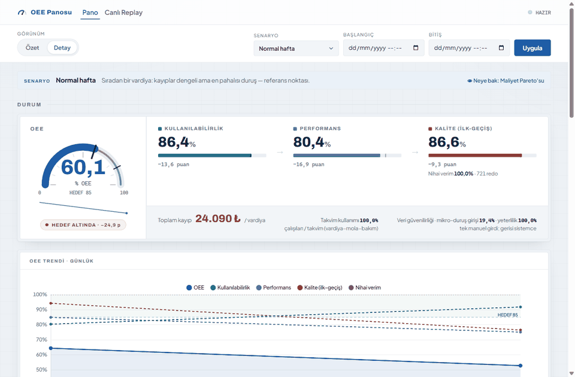
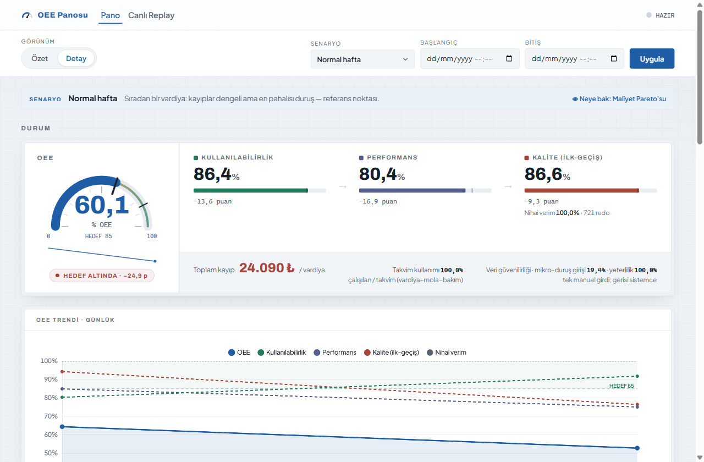
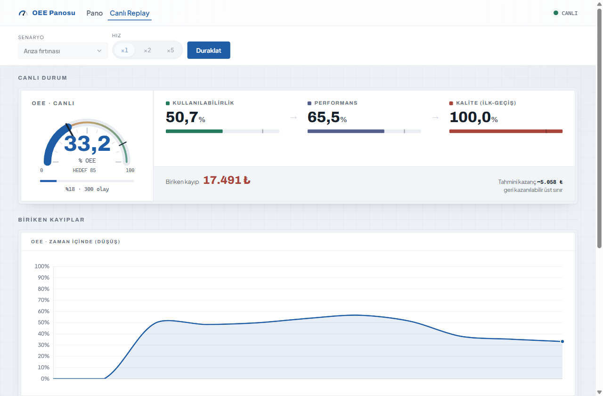

# OEE Platform

**Hattınız nerede para yakıyor?** Kaplama hattı için OEE/verimlilik platformu: genel
CSV'leri (events/production/orders) DuckDB'ye yükler, OEE'yi **yalnızca genel veriden**
hesaplar; en büyük kaybı bulur, **₺'ye çevirir** ve güven aralıklı öneriler üretir.
Pano **React 19 + Vite SPA**; **SSE ile canlı (hızlandırılmış) replay** dahil.




```bash
docker compose up --build      # http://localhost:8000 — pano açılışta dolu gelir
```

**Gezinti:** canlı pano `/` · hızlandırılmış replay (pano içinde sekme) · tanıtım
sayfası `/tanitim` · örnek pilot raporu `/tanitim/ornek-rapor` · sağlık `/health`.

> **Proje durumu / yol haritası:** [`docs/STATUS.md`](docs/STATUS.md) — tamamlanan görevler
> (G1–G5 · Dalga 1 G6·G11·G9 · Dalga 2 G8·GR·G7 · Dalga 3 G12·G4.1·G10·Perf-UI · Hazırlık H1–H9 · Pilot Kiti A+B+C), API yüzeyi,
> mimari kararlar, bilinen sınırlamalar. **Veri sözleşmesi:** [`docs/data-contract.md`](docs/data-contract.md).

> **Frontend tasarımı (UI):** Pano "**The Foundry Gauge**" — açık/kurumsal endüstriyel
> gösterge sistemi. Renk/tipografi token'ları `frontend/src/styles/theme.ts` + `theme.css`'te
> (tek doğruluk kaynağı repo içinde). İmza: **Control Strip hero** (OEE gauge + A×P×Q
> kanal kaskadı + toplam kayıp), anlatısal bölgeler (Durum/Kayıplar/Aksiyon/Veri), zengin
> senaryo dropdown'u, birleşik header (Pano/Replay mod + Özet/Detay görünüm). Türkçe ondalık
> virgül (`theme.ts` `num1`/`pct`).

## Çalıştırma (Docker)

```bash
docker compose up --build      # http://localhost:8000  (açılışta baseline senaryo yüklü)
```
Aynı imaj laptopta `localhost:8000` ve uzak sunucuda public URL ile çalışır. Açılışta
`SAMPLE_DATA_DIR` (compose'da ayarlı) baseline senaryoyu otomatik ingest eder → pano dolu gelir.

## Geliştirme

```bash
cd backend && pip install -r requirements.txt && pytest -q     # 269 test
cd frontend && npm install && npm run dev                      # Vite (backend'e :8000 proxy)
cd frontend && npm run lint && npm run test && npm run build   # vitest + üretim build
```

## Pilot Doctor (Faz 0–1 GO/NO-GO kapısı)

```bash
cd backend && python -m tools.pilot_doctor <veri-dizini> [--adapter <profil>] [--json]
# ya da: make doctor DATA=<dizin>   (yol repo köküne göre; vars. baseline = öz-doğrulama)
```
Saha verisini platforma bağlamadan önce tek komutla denetler: hat doğrulama + adaptör +
smoke ingest (geçici DB) + OEE + veri-yeterlilik + red oranı → GO/NO-GO (exit 0/1).
Ayrıntı: `docs/pilot-kit/04-pilot-runbook.md`.

## Pilot Raporu (Faz 3 artefaktı)

```bash
cd backend && python -m tools.pilot_report <veri-dizini> [--adapter <profil>] -o rapor.html
```
Tek dosyalık, kendine-yeten HTML pilot raporu: OEE + TL Pareto (güven aralıklı) +
öneri kazanç aralıkları + trend + 3 başarı kriteri tablosu. Örnek: `docs/showcase/`
(deploy'da public `/tanitim` tanıtım sayfası + `/tanitim/ornek-rapor`).

## Ekran görüntüleri

| Pano (Control Strip hero) | Canlı Replay |
|---|---|
|  |  |

## İlkeler

- **Şema kutsaldır;** platform verinin simülatörden mi sahadan mı geldiğini bilmez.
- **Firewall:** `ground_truth.csv` ASLA yüklenmez; gerçek yalnız doğrulama testlerinde.
- **Tek doğruluk kaynağı:** OEE/kayıp mantığı platformda; simülatör `metrics.py` yalnız parite referansı.
- **No-scrap modeli (G12):** spec-dışı parça hurdaya gitmez, sıyrılıp iyi olana dek tekrar kaplanır.

## API yüzeyi

```
GET  /health                          -> {"status":"ok"}
POST /ingest        {"path": "...", "adapter": "<profil>"|null}  -> LoadReport
GET  /oee?from=&to=                    -> {availability, performance, quality(=ilk-geçiş), oee,
                                          utilization, planned_downtime_min, final_yield}
GET  /loss-tree?from=&to=             -> {categories:[{category, axis, value, kind}]}  (5 kategori)
GET  /loss-tree/cost?from=&to=        -> {categories:[...,tl,tl_low,tl_high,confidence,low_confidence], total_tl}  (TL azalan)
GET  /recommendations?from=&to=       -> {recommendations:[{category, tl, estimated_gain_tl,
                                          estimated_gain_tl_low/high, title, action, assumption}], ...}
GET  /oee/trend?bucket=day|week       -> [{period, availability, performance, quality, final_yield, oee}]
GET  /data-quality/summary            -> {microstop_entry_coverage}   (G10: tek manuel girdi)
GET  /scenarios                       -> {scenarios:[...]}  (6 demo)
POST /scenarios/{id}/activate         -> repo.reset() + o senaryoyu ingest
GET  /replay/stream?scenario=&speed=&steps=  -> SSE: büyüyen 'şimdiye kadar' snapshot'ları
POST /line/validate {hat-tanımı dict}  -> {valid: bool, errors: [str]}
GET  /                                -> React SPA   ·   GET /legacy -> Jinja fallback
```

## Kayıp ağacı & kalite (Dalga 3)

`GET /loss-tree` **5 kategori** döndürür: DOWNTIME/MICROSTOP (dakika, görünür),
QUALITY_REDO (parça, görünür), FILL_LOSS (parça, çıkarım), SPEED_LOSS (dakika, çıkarım).
Görünür kanallar genel veriden doğrudan; gizli kanallar (doluluk/hız) yalnız çıkarımla
kestirilir. Çıkarım fonksiyonu `ground_truth` almaz (firewall).

OEE'nin Q'su **ilk-geçiş kalite** = `(loaded − redo)/loaded` (redo'yu cezalandırır); ayrıca
**`final_yield`** = `good/loaded` (≈%100, no-scrap'i görünür kılar). G4.1 ile `events.csv`'ye
`carrier_id` eklendiğinden trend/replay'de Performance ve Quality **pencere-doğru** değişir.

## Deploy (başkalarının erişmesi için)

Çok-aşamalı `backend/Dockerfile` (Vite build + Python backend) ve [`render.yaml`](render.yaml)
hazırdır. Render: **New → Blueprint → bu repo → Apply** ile tek tıkla deploy (free, frankfurt,
`$PORT` desteği, `/health` kontrolü). Aynı imaj Railway/Fly/herhangi bir konteyner host'unda çalışır.

**Erişim katmanı (opsiyonel):** Form-tabanlı, tema-uyumlu bir giriş ekranı (`app/auth.py`).
`OEE_AUTH_PASS` env değeri tanımlıysa tüm pano giriş arkasına alınır (kullanıcı: `OEE_AUTH_USER`,
varsayılan `admin`); tanımsızsa auth kapalıdır (yerel dev/test açık). Render'da şifreyi
Dashboard → Environment'tan `OEE_AUTH_PASS`'e gir (bkz. `render.yaml`). `/health` her zaman
public (healthcheck için). Bu basit bir erişim kapısıdır; çok-kullanıcılı kimlik için ileride OAuth/SSO.
